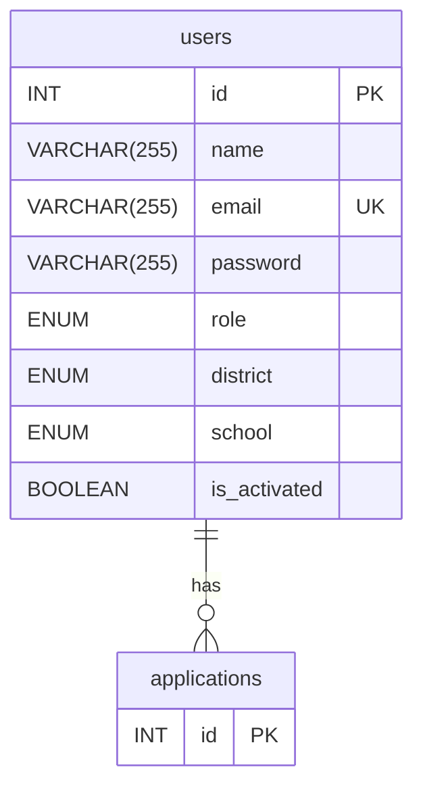

# Features
## Authentication
### Register: `POST /v1/users`
### Login: `POST /v1/tokens`
### Logout: `DELETE /v1/tokens`
---
## User
### Look up a user's info `GET /v1/users/:id`
### Update user info: `PUT /v1/users/:id`
### Look up a user's tweets: `GET /v1/users/:id/tweets`
### Look up a user's replies: `GET /v1/users/{id}:get-replied-tweets`
### Look up a user's liked tweets: `POST /v1/users/:id/likes`
---
## Application
### Read tweets: `GET /v1/tweets`
### Read a tweet: `GET /v1/tweets/:id`
### Post a tweet: `POST /v1/tweets`
### Update a tweet: `PUT /v1/tweets/:id`
### Delete a tweet: `DELETE /v1/tweets/:id`
---
## Reply
### Read all replies of a tweet: `GET /v1/tweets/:id/replies`
### Post a reply: `POST /v1/tweets/:id/replies`
### Update a reply: `PUT /v1/replies/:id`
### Delete a reply: `DELETE /v1/replies/:id`
---
## Like
### Like a tweet: `POST /v1/tweets/:id/likes`
### Unlike a tweet: `DELETE /v1/likes/:id`
---
# ERD

