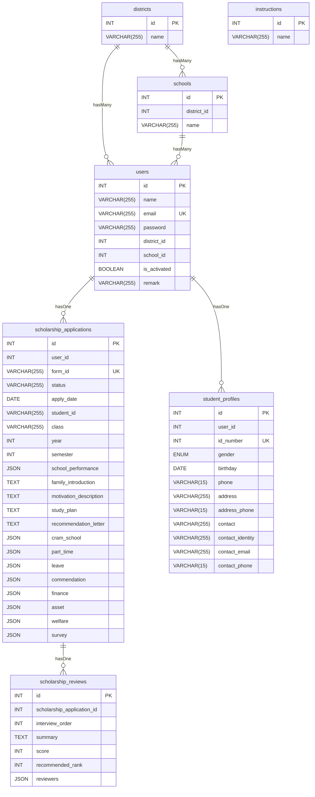

```mermaid
erDiagram
users ||--o{ scholarship_applications : hasOne
districts ||--o{ users : hasMany
schools ||--o{ users : hasMany
users ||--o{ student_profiles : hasOne
scholarship_applications ||--o{ scholarship_reviews : hasOne
districts ||--o{ schools : hasMany

    users {
        INT id PK
        VARCHAR(255) name
        VARCHAR(255) email UK
        VARCHAR(255) password
        INT district_id
        INT school_id
        BOOLEAN is_activated
        VARCHAR(255) remark
    }

    districts {
        INT id PK
        VARCHAR(255) name
    }

    schools {
        INT id PK
        INT district_id
        VARCHAR(255) name
    }

    scholarship_applications {
        INT id PK
        INT user_id
        VARCHAR(255) form_id UK
        VARCHAR(255) status
        DATE apply_date
        VARCHAR(255) student_id
        VARCHAR(255) class
        INT year
        INT semester
        JSON school_performance
        TEXT family_introduction
        TEXT motivation_description
        TEXT study_plan
        TEXT recommendation_letter
        JSON cram_school
        JSON part_time
        JSON leave
        JSON commendation
        JSON finance
        JSON asset
        JSON welfare
        JSON survey
    }

    scholarship_reviews {
       INT id PK
       INT scholarship_application_id
       INT interview_order
       TEXT summary
       INT score
       INT recommended_rank
       JSON reviewers
    }

    student_profiles {
       INT id PK
       INT user_id
       INT id_number UK
       ENUM gender
       DATE birthday
       VARCHAR(15) phone
       VARCHAR(255) address
       VARCHAR(15) address_phone
       VARCHAR(255) contact
       VARCHAR(255) contact_identity
       VARCHAR(255) contact_email
       VARCHAR(15) contact_phone
    }

    instructions {
       INT id PK
       VARCHAR(255) name
    }

```